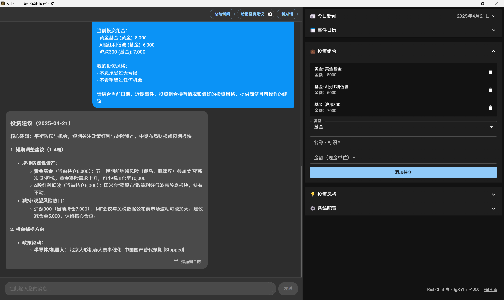

# RichChat

    

    <a href="README-CN.md">中文 README</a> | <a href="README.md">English README</a>

欢迎使用 **RichChat**，您的 AI 驱动投资顾问，旨在帮助您轻松自信地做出明智的财务决策。无论您是经验丰富的投资者还是刚刚起步，RichChat 都能根据您的独特投资档案提供个性化的见解和策略。

## 功能

### 个性化投资组合

- **可定制的投资组合**：通过用户友好的界面轻松管理和调整您的投资组合。只需点击几下即可添加或移除资产。
- **多样化的资产选项**：从广泛的投资选项中进行选择，包括黄金基金、股票基金等，以实现投资组合的多样化。

### 智能投资建议

- **短期和长期策略**：根据您的财务目标，提供量身定制的投资策略，无论您是寻求短期收益还是长期增长。
- **风险管理**：获取潜在风险和机会的见解，帮助您做出平衡的决策以保护您的投资。

### 实时市场洞察

- **最新新闻**：通过最新的市场新闻和趋势保持信息更新，确保您不会错过任何机会。
- **事件日历**：跟踪可能影响您投资的重要财务事件和更新。

### 用户友好的界面

- **直观的设计**：凭借简洁现代的界面，轻松导航应用程序，优先考虑用户体验。
- **互动元素**：通过互动组件进行参与，使管理您的投资既简单又愉快。

### 安全可靠

- **数据隐私**：您的财务数据受到顶级安全措施的保护，确保您的信息保持机密。
- **可靠的性能**：体验流畅且响应迅速的应用程序，实时提供更新和建议，无延迟。

## 入门指南

1. **下载和安装**：在您的设备上获取 RichChat，并在几分钟内设置您的帐户。
2. **设置您的偏好**：自定义您的投资档案，以接收符合您财务目标的建议。
3. **探索和投资**：在 RichChat 的专家见解指导下，自信地进入投资世界。
