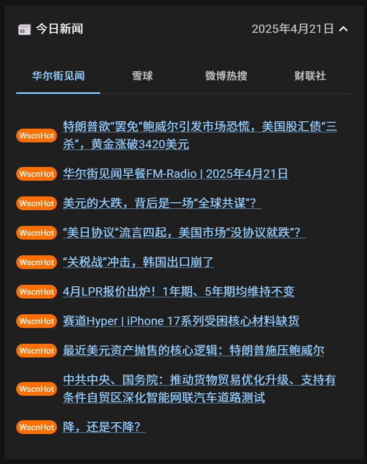

    

# RichChat

    <a href="README-CN.md">中文 README</a> | <a href="README.md">English README</a>

欢迎使用 **RichChat**，您的个性化的 AI 驱动的投资顾问！

## 🌝 开始

### 直接下载

请访问 [RichChat Releases](https://github.com/z0gSh1u/richchat/releases) 下载最新版本。我们提供适用于 Windows 和 MacOS（暂未测试）的版本。

### 自行构建

RichChat 使用 Tauri 框架，您需要 Node.js 和 Rust 环境。随后可使用 `pnpm tauri build` 命令构建。

## 🔮 功能

### 每日新闻

    

通过来自华尔街见闻、雪球、微博热搜、财联社的最新市场新闻，使 LLM 保持信息更新。

> \[!TIP]
>
> 本功能基于 [newsnow](https://github.com/ourongxing/newsnow) 整理的有关 API。

### 事件日历

    

将包括每日新闻总结、每日投资建议在内的各种信息存入日历中，为 RichChat 提供带时间维度的信息源。

### 投资组合

    

管理包括现金理财、债券、基金、贵金属在内的多种投资标的的持仓，使 RichChat 给出具体的调仓建议。

> \[!TIP]
>
> 对于基金，在录入持仓时无需具体到基金公司。例如，“中证 A50”就是个好的名称。

### 投资风格

    

描述您的投资风格能让 RichChat 更好地理解您的投资目标和风险承受能力，从而提供更符合您需求的建议。

> \[!TIP]
>
> 您可以描述您的投资风格，例如“专注于高股息股票”或“偏好长期增长”。

### 系统配置

    

RichChat 支持 DeepSeek V3、DeepSeek R1（深度思考）在内的模型，您可自行配置 API Key。使用过程中产生的所有数据
也均保存在您本地的 SQLite 数据库中，无须担心 RichChat 引入的数据安全问题。

## ⭐ 保持关注

如果您觉得这个项目对您有帮助，请不要忘记为它点亮 Star。

项目正在持续迭代中，新的功能和改进将不断推出。

## 📜 许可证

版权所有 © 2025 by [z0gSh1u](https://github.com/z0gSh1u)

本项目采用 [MIT 许可证](LICENSE)。这是一种宽松的开源许可证，作者不对软件的使用承担责任。
