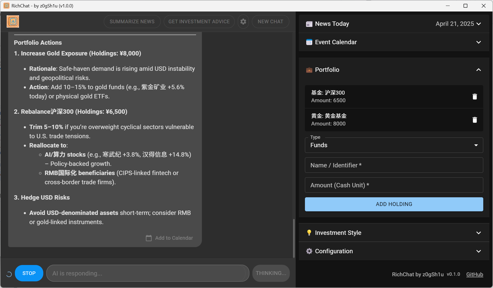
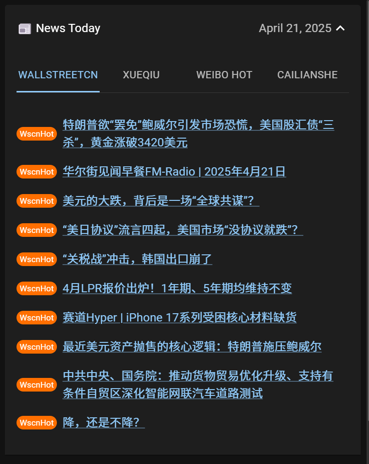
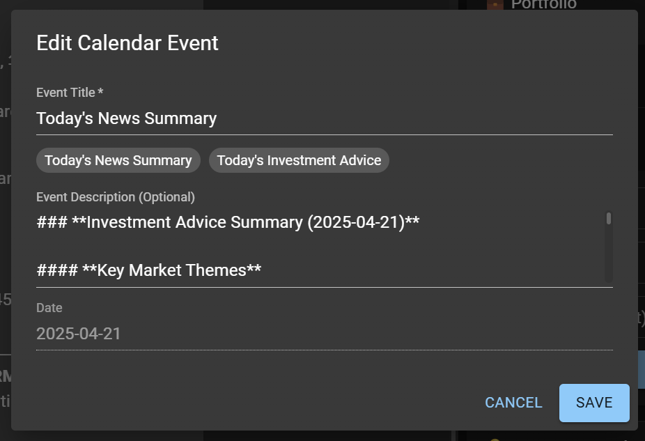
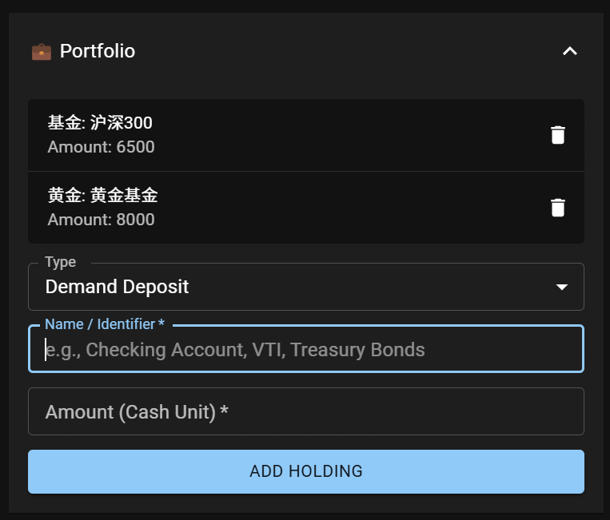
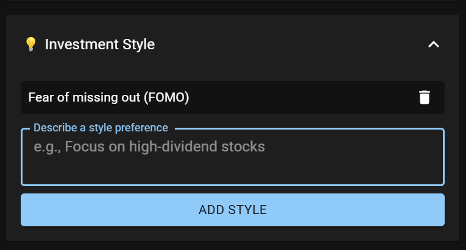
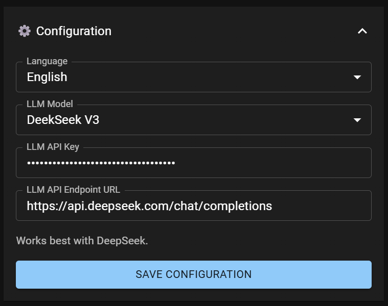

    

# RichChat

    <a href="README-CN.md">中文 README</a> | <a href="README.md">English README</a>

Welcome to **RichChat**, your personalized AI-driven investment advisor!

## 🌝 Getting Started

### Direct Download

Please visit [RichChat Releases](https://github.com/z0gSh1u/richchat/releases) to download the latest version. We offer versions for Windows and MacOS (not yet tested).

### Build Yourself

RichChat uses the Tauri framework, and you need Node.js and Rust environments. You can then build using the `pnpm tauri build` command.

## 🔮 Features

### Daily News

    

Keep the LLM updated with the latest market news from Wall Street Insights, Snowball, Weibo Hot Search, and Cailian Press.

> \[!TIP]
>
> This feature is based on the APIs organized by [newsnow](https://github.com/ourongxing/newsnow).

### Event Calendar

    

Store various information, including daily news summaries and daily investment advice, into the calendar, providing RichChat with a time-dimensional information source.

### Portfolio

    

Manage holdings of various investment targets, including cash management, bonds, funds, and precious metals, so that RichChat can provide specific rebalancing suggestions.

> \[!TIP]
>
> For funds, there is no need to specify the fund company when entering holdings. For example, "CSI A50" is a good name.

### Investment Style

    

Describing your investment style allows RichChat to better understand your investment goals and risk tolerance, providing advice that better meets your needs.

> \[!TIP]
>
> You can describe your investment style, such as "focus on high dividend stocks" or "prefer long-term growth."

### System Configuration

    

RichChat supports models including DeepSeek V3 and DeepSeek R1 (Deep Thinking), and you can configure the API Key yourself. All data generated during use is also stored in your local SQLite database, so there is no need to worry about data security issues introduced by RichChat.

## ⭐ Stay Tuned

If you find this project helpful, don't forget to give it a Star.

The project is continuously iterating, and new features and improvements will be launched continuously.

## 📜 License

Copyright © 2025 by [z0gSh1u](https://github.com/z0gSh1u)

This project is licensed under the [MIT License](LICENSE). This is a permissive open-source license, and the author is not responsible for the use of the software.
