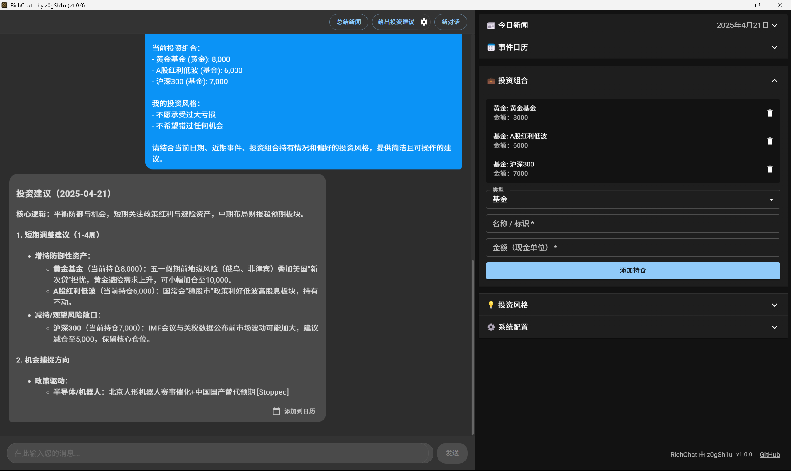

# RichChat

    

    <a href="README-CN.md">中文 README</a> | <a href="README.md">English README</a>

Welcome to **RichChat**, your AI-powered investment advisor designed to help you make informed financial decisions with ease and confidence. Whether you're a seasoned investor or just starting out, RichChat provides personalized insights and strategies tailored to your unique investment profile.

## Features

### Personalized Investment Portfolio

- **Customizable Portfolios**: Easily manage and adjust your investment portfolio with a user-friendly interface. Add or remove assets with just a few clicks.
- **Diverse Asset Options**: Choose from a wide range of investment options, including gold funds, equity funds, and more, to diversify your portfolio.

### Intelligent Investment Advice

- **Short-term and Long-term Strategies**: Receive tailored investment strategies that align with your financial goals, whether you're looking for short-term gains or long-term growth.
- **Risk Management**: Get insights into potential risks and opportunities, helping you make balanced decisions that protect your investments.

### Real-time Market Insights

- **Up-to-date News**: Stay informed with the latest market news and trends, ensuring you never miss an opportunity.
- **Event Calendar**: Keep track of important financial events and updates that could impact your investments.

### User-friendly Interface

- **Intuitive Design**: Navigate through the app with ease, thanks to a clean and modern interface that prioritizes user experience.
- **Interactive Elements**: Engage with interactive components that make managing your investments both simple and enjoyable.

### Secure and Reliable

- **Data Privacy**: Your financial data is protected with top-notch security measures, ensuring your information remains confidential.
- **Reliable Performance**: Experience a smooth and responsive app that delivers real-time updates and advice without delay.

## Getting Started

1. **Download and Install**: Get RichChat on your device and set up your account in minutes.
2. **Set Your Preferences**: Customize your investment profile to receive advice that matches your financial goals.
3. **Explore and Invest**: Dive into the world of investments with confidence, guided by RichChat's expert insights.

## Join the Community

Become part of a growing community of investors who trust RichChat to guide their financial journey. Share your experiences, learn from others, and grow your wealth together.
